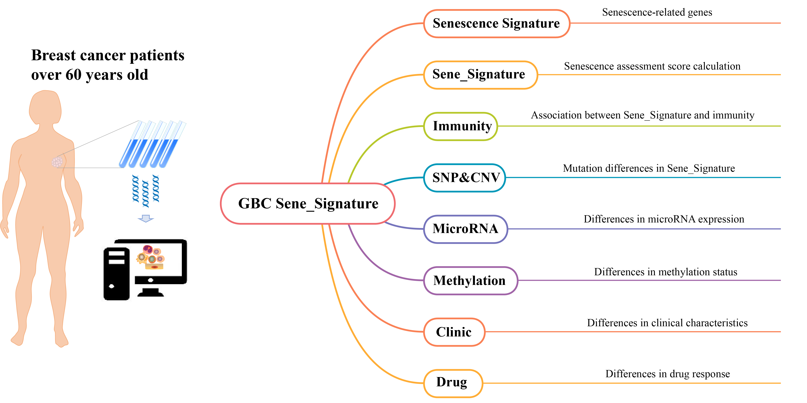

# Welcome to the Senescence Assessment Research Project Website for Geriatric Breast Cancer (GBC)

About Us

We are an interdisciplinary team dedicated to cancer and senescence research, focusing on understanding the relationship between aging processes and cancer in elderly patients. Our mission is to explore the molecular mechanisms in GBC through in-depth mining of genetic, tissue, and clinical data, in order to find more precise and effective treatment strategies.

Project Overview

Our research project focuses on the "Sene_Signature for GBC" - a new research field that aims to use bioinformatics and machine learning algorithms to quantify the level of aging based on patients' gene expression data. Through this score, we can not only better understand the biological characteristics of elderly patients, but also provide new ideas for individualized treatment.

[Senescence Signature: Senescence-related genes](http://zhaoliminlab.cn:8080/GBC/tool1.jsp)

Our focus is on identifying signature genes in GBC patients. By utilizing databases, we search for key genes associated with senescence. By incorporating senescence genes into our "Sene_Signature" model, we aim to investigate the correlation between the "Sene_Signature" and aging-related genes. Through enrichment analysis, we aim to demonstrate that these genes not only serve as biomarkers of the senescence process but may also be associated with the development of cancer in the elderly.

[Sene_Signature: Calculation of senescence Score](http://zhaoliminlab.cn:8080/GBC/tool2.jsp)

Using our unique algorithm, we calculate the "Sene_Signature" for GBC patients based on gene expression data. This score serves as a quantitative measure of the patient's level of senescence, providing insights into the senescence status of GBC patients.

[immunity: Association between senescence Score and Immunity](http://zhaoliminlab.cn:8080/GBC/tool3.jsp)

We explore the relationship between the immune system of GBC patients and their aging scores. By studying the immune cell types and immune gene expression of patients with different "Sene_Signature" , we aim to reveal how aging affects the function of the immune system.

[SNP&CNV: Mutation Differences Analysis](http://zhaoliminlab.cn:8080/GBC/tool4.jsp)

Using bioinformatics tools, we analyze single nucleotide site mutations and copy number variations in GBC patients. These variations, which are potentially critical in the development of cancer in the elderly, will be further investigated for their role in the cancer progression.

[MicroRNA: microRNA Expression Differences](http://zhaoliminlab.cn:8080/GBC/tool5.jsp)

This tool focuses on the expression differences of microRNAs in GBC. microRNAs play a crucial role in gene expression regulation, and their abnormal expression may be associated with the development of cancer in GBC. We aim to investigate the potential biological significance of these differential expressed microRNAs in relation to "Sene_Signature".

[Methylation: DNA Methylation Differences Analysis](http://zhaoliminlab.cn:8080/GBC/tool6.jsp)

We explore the DNA methylation differences between high and low "Sene_Signature" groups of elderly cancer patients. DNA methylation is a common gene expression regulation mechanism, and its abnormality may be closely related to tumorigenesis and cancer development in the elderly. We aim to study the DNA methylation patterns of patients with different "Sene_Signature".

[Clinic: Association between Clinical Features and Sene_Signature](http://zhaoliminlab.cn:8080/GBC/tool7.jsp)

By associating clinical features of GBC patients, such as age, gender, pathological type, etc., with their aging scores, we aim to gain insights into whether there are significant differences in the "Sene_Signature" among patients with different clinical features.

[Drug: Drug Response Difference Analysis](http://zhaoliminlab.cn:8080/GBC/tool8.jsp)

We investigate the differential response of elderly cancer patients to various therapeutic drugs. By exploring the sensitivity of patients with different "Sene_Signature" to treatment drugs, we aim to provide reference for individualized treatment of elderly cancer.
